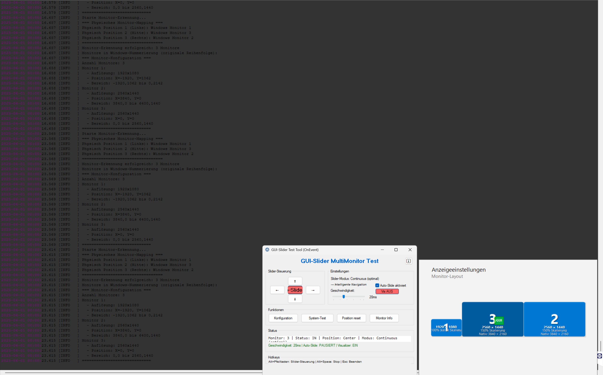

# GUI-Slider-MultiMonitor

Ein professionelles AutoIt-Tool für intelligente GUI-Navigation zwischen mehreren Monitoren.


*GUI-Slider mit Windows 11 Style Visualizer in Aktion*

## 🚀 Features

- **4 Slider-Modi**: Standard, Classic, Direct, Continuous (empfohlen)
- **Multi-Monitor**: Unterstützt 1-12 Monitore in beliebiger Anordnung
- **Windows 11 Style Visualizer**: Real-time Monitor-Layout mit interaktiver Steuerung
- **Auto-Slide System**: Intelligente Maus-Erkennung mit konfigurierbaren Delays
- **Perfekte Navigation**: Direkte Pfade mit Ease-In-Out Animation
- **Umfangreiches Logging**: Debug-Informationen für Troubleshooting

## 📦 Installation

1. **Download**: `SliderSystem.au3` herunterladen
2. **Include**: In Ihr AutoIt-Projekt einbinden:
   ```autoit
   #include "SliderSystem.au3"
   ```

## ⚡ Schnellstart

```autoit
#include <GUIConstantsEx.au3>
#include "SliderSystem.au3"

; Ihr GUI erstellen
Local $hGUI = GUICreate("Mein Programm", 400, 300)
Local $btnSlideLeft = GUICtrlCreateButton("← Links", 10, 10, 60, 30)
GUISetState(@SW_SHOW, $hGUI)

; Slider-System aktivieren
_SliderSystem_Init($hGUI)
_SliderSystem_SetMode($SLIDER_MODE_CONTINUOUS)
_SliderSystem_EnableAutoSlideIn()

; Event-Loop
While 1
    Local $msg = GUIGetMsg()
    
    Switch $msg
        Case $GUI_EVENT_CLOSE
            ExitLoop
        Case $btnSlideLeft
            _SliderSystem_SlideLeft()
    EndSwitch
    
    Sleep(10)
WEnd

; Cleanup
_SliderSystem_Cleanup()
```

## 🎛️ Slider-Modi

### **Continuous Mode** (EMPFOHLEN) ⭐
```autoit
_SliderSystem_SetMode("Continuous")
```
- Intelligente Navigation zu entferntesten Monitoren
- Perfekte Verfahrwege mit Versatz-Berücksichtigung
- Slide OUT am Zielmonitor in gewünschter Richtung
- Optimal für komplexe Multi-Monitor-Setups

### **Direct Mode**
```autoit
_SliderSystem_SetMode($SLIDER_MODE_DIRECT)
```
- Ignoriert Nachbar-Monitore
- Fährt sofort am aktuellen Monitor raus

### **Classic Mode**
```autoit
_SliderSystem_SetMode($SLIDER_MODE_CLASSIC)
```
- Zwei-Klick-System
- 1. Klick = Monitor wechseln, 2. Klick = Slide OUT

### **Standard Mode**
```autoit
_SliderSystem_SetMode($SLIDER_MODE_STANDARD)
```
- Original-Verhalten
- Monitor-Wechsel bei Nachbarn, sonst Slide OUT

## 📋 Funktionsreferenz

### Initialisierung
- `_SliderSystem_Init($hGUI)` - Initialisiert das System für ein GUI
- `_SliderSystem_Cleanup()` - Bereinigt das System

### Konfiguration
- `_SliderSystem_SetMode($sMode)` - Setzt den Slider-Modus
- `_SliderSystem_EnableAutoSlideIn($bEnable, $iDelay)` - Auto-Slide-In aktivieren

### Slide-Funktionen
- `_SliderSystem_SlideLeft()` - Slide nach links
- `_SliderSystem_SlideRight()` - Slide nach rechts
- `_SliderSystem_SlideUp()` - Slide nach oben
- `_SliderSystem_SlideDown()` - Slide nach unten

### Info-Funktionen
- `_SliderSystem_GetCurrentMonitor()` - Aktuelle Monitor-Nummer
- `_SliderSystem_IsSlideOut()` - Prüft ob ausgefahren
- `_SliderSystem_GetSlidePosition()` - Aktuelle Position
- `_SliderSystem_GetMode()` - Aktueller Modus

## 💡 Beispiele

### Mit Hotkeys
```autoit
; Hotkeys registrieren
HotKeySet("!{LEFT}", "_MySlideLeft")   ; Alt+Links
HotKeySet("!{RIGHT}", "_MySlideRight") ; Alt+Rechts

Func _MySlideLeft()
    _SliderSystem_SlideLeft()
EndFunc

Func _MySlideRight()
    _SliderSystem_SlideRight()
EndFunc
```

### Mit Status-Updates
```autoit
; Status-Label in Ihrem GUI
Local $lblStatus = GUICtrlCreateLabel("", 10, 250, 380, 20)

; In Event-Loop aktualisieren
Local $sStatus = "Monitor: " & _SliderSystem_GetCurrentMonitor() & " | "
$sStatus &= "Status: " & (_SliderSystem_IsSlideOut() ? "OUT" : "IN")
GUICtrlSetData($lblStatus, $sStatus)
```

## 🖥️ Multi-Monitor-Unterstützung

- **1-12 Monitore** unterstützt
- **Beliebige Anordnungen** (horizontal, vertikal, L-Form, etc.)
- **DPI-Skalierungs-Unterstützung** (100%, 125%, 150%, 175%, 200%)
- **Physisches Mapping** für korrekte Navigation
- **Hot-Plug Support** für Monitor-Änderungen

## 🎨 Windows 11 Style Visualizer

- **Real-time Monitor-Darstellung** mit korrekten Positionen
- **GUI-Status-Visualisierung** (Orange=ausgefahren, Grün=eingefahren)
- **Interaktive Steuerung** (Klick auf Monitor wechselt dorthin)
- **Info-Button** für System-Informationen
- **Sichtbare Bereiche** (8-Pixel Edge-Detection)

## 📁 Datei-Struktur

```
GUI-Slider-MultiMonitor/
├── SliderSystem.au3                    # Haupt-API Interface
├── src/
│   ├── main.au3                        # Haupteinstiegspunkt
│   ├── includes/
│   │   ├── Constants.au3               # System-Konstanten
│   │   ├── GlobalVars.au3              # Globale Variablen
│   │   └── Settings.au3                # Settings-Management
│   ├── modules/
│   │   ├── AutoSlideMode.au3           # Auto-Slide System
│   │   ├── ConfigManager.au3           # Konfigurationsverwaltung
│   │   ├── GUIControl.au3              # Haupt-GUI und Events
│   │   ├── MonitorDetection.au3        # Monitor-Erkennung
│   │   ├── SliderLogic.au3             # Kern-Sliding-Logik
│   │   └── Visualization.au3           # Windows 11 Visualizer
│   └── config/
│       └── settings.ini.example        # Beispiel-Konfiguration
├── examples/
│   └── simple-example-onevent.au3      # Vollständiges Beispiel
├── docs/
│   ├── PROJECT_STATUS_FINAL.md         # Finaler Projektstatus
│   ├── ARCHITECTURE.md                 # Architektur-Dokumentation
│   └── Ansicht1.jpg                    # Screenshot
└── tests/
    ├── debug_monitors.au3              # Monitor-Debug-Tool
    └── test_monitor_detection.au3      # Monitor-Tests
```

## ✅ Status: PRODUCTION READY

**Version**: 2.0 Final  
**Empfohlener Modus**: Continuous  
**Getestet mit**: Windows 10/11, Multi-Monitor-Setups  
**Performance**: < 1% CPU, ~15MB RAM

## 🧪 Testen

```autoit
; Test-Beispiel ausführen
examples\simple-example.au3

; Alle Modi testen
tests\test-all-modes.au3
```

## 🤝 Beitragen

1. Fork das Repository
2. Erstelle einen Feature-Branch
3. Committe deine Änderungen
4. Erstelle einen Pull Request

## 📄 Lizenz

MIT License - siehe [LICENSE](LICENSE) Datei für Details.

## 👤 Autor

**Ralle1976** - [GitHub](https://github.com/Ralle1976)

## 🔗 Links

- [GitHub Repository](https://github.com/Ralle1976/AutoIt-GUI-Slider-MultiMonitor)
- [AutoIt Community](https://www.autoitscript.com/forum/)
- [Beispiele und Tutorials](examples/)